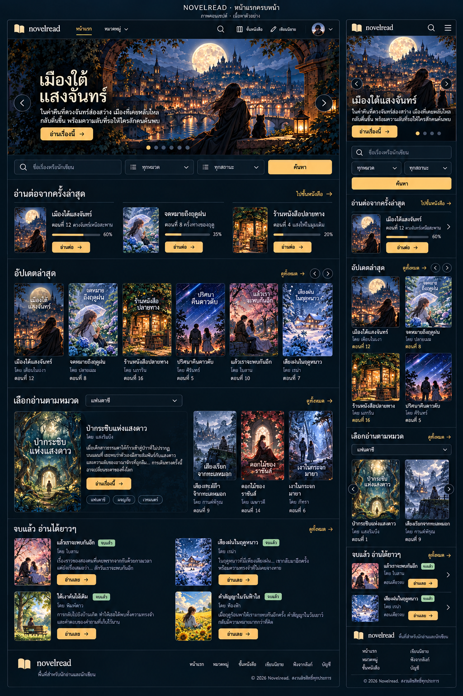
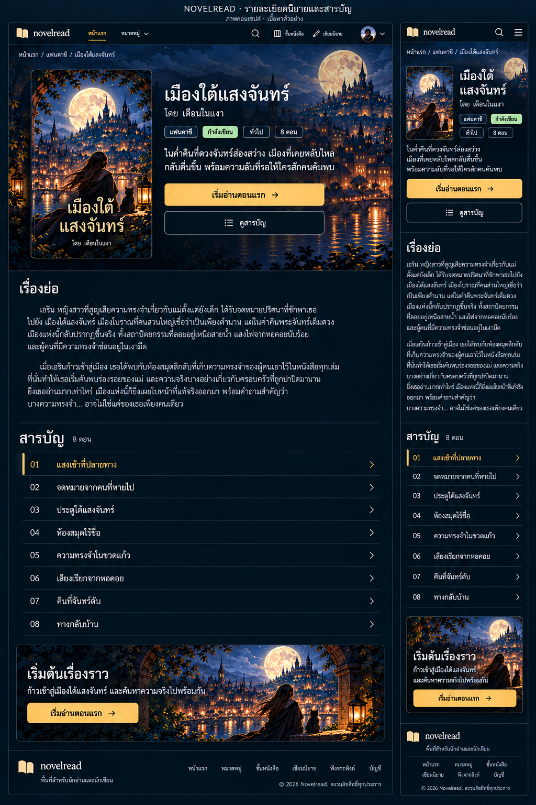
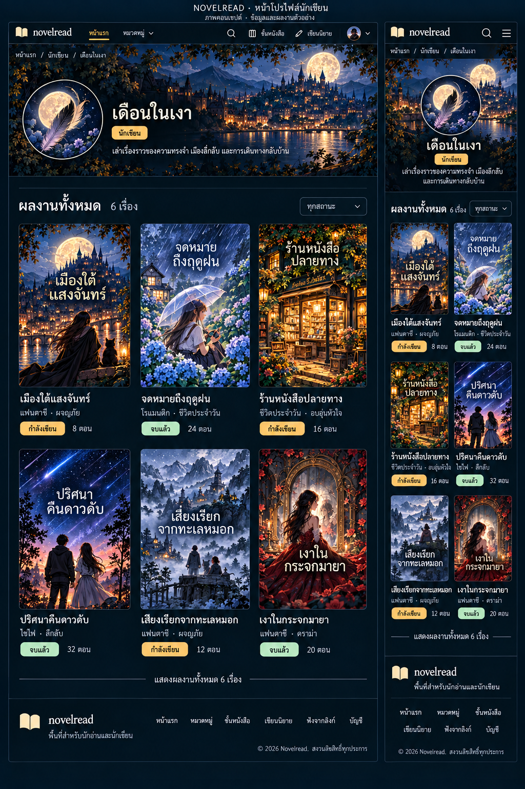

# Novelread: แบบ UI ที่ตกลงร่วมกัน

อัปเดต 8 ตุลาคม 2026

## สถานะและขั้นตอน

ผู้ใช้อนุมัติแนว C และภาพหน้าแรกเต็มหน้าถึงฟุตเตอร์แล้ว เอกสารนี้เป็นแนวทางหลักสำหรับการออกแบบรอบใหม่ แทนแนวสีขาว–น้ำเงินใน UI-REDESIGN.md เมื่อขัดแย้งกัน

สร้างภาพคอนเซปต์ทีละหน้า ทุกภาพต้องแสดงตั้งแต่หัวเว็บถึงฟุตเตอร์ พร้อมเดสก์ท็อปและมือถือ ให้ผู้ใช้เลือกก่อนนำไปลงโค้ด การอนุมัติหน้าแรกไม่ได้หมายถึงการอนุมัติหน้าที่เหลือ

## ภาษาภาพที่อนุมัติ

- แนว C: Story Cinema พื้นกรมท่าเกือบดำ ตัวอักษรสีงาช้าง สีทองอุ่นสำหรับปุ่มหลักและสถานะที่เลือก ให้ภาพนิยายเป็นจุดนำสายตา
- ใช้ฟอนต์ไทยอ่านง่าย ลำดับขนาดหัวข้อ ชื่อเรื่อง และรายละเอียดชัดเจน
- ปกสัดส่วนประมาณ 2:3 และภาพสไลด์แนวนอนที่ครอปให้เหมาะกับมือถือ
- ใช้เส้นขอบกับช่องกรอก dropdown และปุ่มรอง เพื่อให้เห็นว่าใช้งานได้ ใช้พื้นที่และเส้นคั่นแบ่งส่วนเนื้อหา ไม่ครอบทุกส่วนด้วยการ์ด
- มุมโค้งสม่ำเสมอประมาณ 8–12px การเคลื่อนไหวสั้นและเคารพ reduced motion
- Taste: DESIGN_VARIANCE 6 / MOTION_INTENSITY 3 / VISUAL_DENSITY 6
- Antislop: ENERGY 2 / RHYTHM 3 / MOTION 2
- เหตุผล: โทนเข้มช่วยขับภาพปก สีทองระบุการกระทำหลัก รูปแบบรายการที่ต่างกันช่วยแยกการอ่านต่อ การเลือกเรื่องใหม่ และเรื่องจบแล้ว

## หน้าแรก: อนุมัติแล้ว

1. เมนูหลัก
2. สไลด์นิยาย พร้อมปุ่มก่อนหน้า–ถัดไปและจุดบอกหน้า ไม่หมุนเอง
3. ช่องค้นหา หมวด สถานะ และปุ่มค้นหาเป็นกลุ่มเดียวกัน
4. อ่านต่อจากครั้งล่าสุด แสดงเมื่อมีประวัติการอ่าน
5. นิยายอัปเดตล่าสุด แบบแถวปกพร้อมปุ่มเลื่อน
6. เลือกอ่านตามหมวดด้วย dropdown
7. นิยายจบแล้ว แบบรายการปกและคำโปรย
8. ฟุตเตอร์กระชับพร้อมลิงก์หน้าที่มีจริง

เดสก์ท็อป: โลโก้ หน้าแรก หมวดหมู่ ปุ่มค้นหา ชั้นหนังสือ เขียนนิยาย เมนูบัญชี

มือถือ: โลโก้ ปุ่มค้นหา แฮมเบอร์เกอร์ บัญชีอยู่ในเมนูที่เปิดออกมา ไม่มีลิงก์บัญชีแยกข้างนอก เมนูรวมหน้าแรก หมวดหมู่ ชั้นหนังสือ เขียนนิยาย ฟังจากลิงก์ และบัญชี/เข้าสู่ระบบตามสถานะ

## หน้าถัดไปและสถานะ

1. รายละเอียดนิยายและสารบัญ: สร้างภาพเสนอแล้ว ยังไม่อนุมัติ ดูภาพด้านล่าง
2. อ่านตอน: รอออกแบบ
3. ชั้นหนังสือ: รอออกแบบ
4. บัญชี / เข้าสู่ระบบ / สมัครสมาชิก: รอออกแบบ
5. พื้นที่นักเขียน: รอออกแบบ
6. จัดการเรื่องและตอน: รอออกแบบ
7. ฟังจากลิงก์: รอออกแบบ
8. ผลค้นหา: รอออกแบบสถานะต่อจากหน้าแรก

## ภาพเสนอ: รายละเอียดนิยายและสารบัญ

เพิ่มเติมที่ผู้ใช้อนุมัติ: เพิ่มส่วน “นิยายแนวเดียวกัน” ใต้สารบัญก่อนฟุตเตอร์ แสดงนิยายที่เผยแพร่ของนักเขียนคนอื่นซึ่งมีหมวดใกล้กัน ไม่รวมเรื่องปัจจุบัน และไม่ปะปนกับผลงานอื่นของเจ้าของเรื่อง แสดง 4–6 เรื่องบนคอม มือถือเห็นประมาณ 2 เรื่องพร้อมปุ่มเลื่อน หากไม่มีเรื่องที่ตรงเงื่อนไขให้ซ่อนส่วนนี้ ใช้ข้อมูลหมวดจริงในการเลือก ไม่อ้างว่าเป็นคำแนะนำเฉพาะบุคคล ผู้ใช้ระบุว่าไม่ต้องเจนภาพหน้านี้ซ้ำ

ให้ส่วนนี้แทนแบนเนอร์ชวนเริ่มอ่านซ้ำท้ายหน้าในภาพเดิม เพื่อไม่ให้หน้าท้ายยาวและซ้ำซ้อน ปุ่มเริ่มอ่านหลักยังอยู่บริเวณข้อมูลเรื่อง

โครงหน้า: เมนู → breadcrumb → ปกและข้อมูลเรื่องพร้อมปุ่มเริ่มอ่าน/ดูสารบัญ → เรื่องย่อ → รายการตอน → ปุ่มเริ่มอ่านท้ายหน้า → ฟุตเตอร์ ภาพมีทั้งคอมและมือถือ ข้อมูล 8 ตอนเป็นตัวอย่าง; เว็บจริงต้องรองรับจำนวนตอนจริงและกรณียังไม่มีตอน

## ข้อกำหนดเมื่อลงโค้ด

## ภาพเสนอ: โปรไฟล์นักเขียน (รออนุมัติ)

โครงหน้า: เมนู → breadcrumb → ภาพและนามปากกานักเขียนพร้อมคำแนะนำตัว → ผลงานทั้งหมดและตัวกรองสถานะ → ฟุตเตอร์ รายการแสดง 3 คอลัมน์บนคอมและ 2 คอลัมน์บนมือถือ ภาพประจำตัว แบนเนอร์ คำแนะนำตัว และผลงาน 6 เรื่องเป็นข้อมูลตัวอย่างสำหรับคอนเซปต์ ต้องตรวจความพร้อมของข้อมูลโปรไฟล์ก่อนพัฒนา และมี fallback หากไม่มีภาพหรือคำแนะนำตัว จำนวนเรื่องต้องมาจากข้อมูลจริง

## ข้อกำหนดการนำไปใช้

### หน้าโปรไฟล์นักเขียนและการเชื่อมชื่อผู้เขียน

ข้อกำหนดเพิ่มเติมจากผู้ใช้: ชื่อผู้เขียนในหน้ารายละเอียดนิยายต้องเป็นลิงก์ไปหน้าโปรไฟล์สาธารณะของผู้เขียนคนนั้น หน้าโปรไฟล์ต้องแสดงชื่อ/นามปากกาและรายการนิยายที่เผยแพร่ของผู้เขียน โดยแต่ละเรื่องกดไปหน้ารายละเอียดนิยายได้

- ใช้ตัวระบุผู้เขียนที่คงที่ในการเชื่อมข้อมูล ห้ามจับคู่ผลงานด้วยข้อความนามปากกาเพียงอย่างเดียว เพราะอาจซ้ำหรือเปลี่ยนได้
- แสดงเฉพาะผลงานที่เผยแพร่และผู้ชมมีสิทธิ์เห็น ไม่เปิดเผยฉบับร่างหรือข้อมูลบัญชีส่วนตัว
- การ์ดผลงานแสดงปก ชื่อเรื่อง หมวด สถานะ และจำนวนตอนตามข้อมูลจริง พร้อมสถานะกรณียังไม่มีผลงานเผยแพร่
- ชื่อผู้เขียนที่เป็นลิงก์ต้องเห็นสถานะ hover/focus ชัด และใช้พฤติกรรมเดียวกันในตำแหน่งอื่นที่แสดงผู้เขียน โดยไม่ซ้อนลิงก์ไว้ในลิงก์การ์ดนิยาย
- เพิ่มหน้าโปรไฟล์นักเขียนเป็นหน้าที่ต้องเจนภาพเต็มทั้งคอมและมือถือเพื่อให้ผู้ใช้เลือก ยังไม่ได้อนุมัติภาพหรือพัฒนาฟังก์ชันนี้
- หน้าโปรไฟล์นักเขียนเน้นผลงานของเจ้าของโปรไฟล์เท่านั้น ส่วนแนะนำนิยายของคนอื่นอยู่ในหน้ารายละเอียดนิยาย เพื่อให้ความเป็นเจ้าของผลงานชัดเจน
- ภาพรายละเอียดนิยายล่าสุดเป็นภาพก่อนเพิ่มข้อกำหนดนี้ การลงโค้ดต้องทำชื่อผู้เขียนให้คลิกได้ตามข้อกำหนดนี้

- ใช้ Next.js และฐานคอมโพเนนต์ shadcn/ui ที่ใช้ซ้ำได้ ตรวจแพ็กเกจจริงก่อนเลือกเพิ่ม
- ภาพนี้เป็นคอนเซปต์ ปก ชื่อผู้เขียน เนื้อหา จำนวนตอน และความคืบหน้าเป็นตัวอย่าง ไม่ใช่ข้อมูลจริงหรือฟังก์ชันที่มีครบแล้ว
- ตรวจการเชื่อมข้อมูลจริงก่อนลงแต่ละส่วน โดยเฉพาะแหล่งข้อมูลสไลด์และประวัติอ่าน ห้ามสร้างอันดับ ยอดขาย หรือสถิติปลอม
- ตรวจทุกหน้าทั้ง loading, empty, error และสถานะเข้า/ออกจากระบบ รวมถึง keyboard focus และ contrast
- ตรวจ responsive จากหน้าเว็บจริงที่ 320, 375, 390, 768, 1024 และ 1440px ปุ่มมือถือมีพื้นที่กดอย่างน้อย 44px
- การอนุมัติภาพไม่ใช่หลักฐานว่าหน้าเว็บทำเสร็จหรือผ่านการทดสอบ
